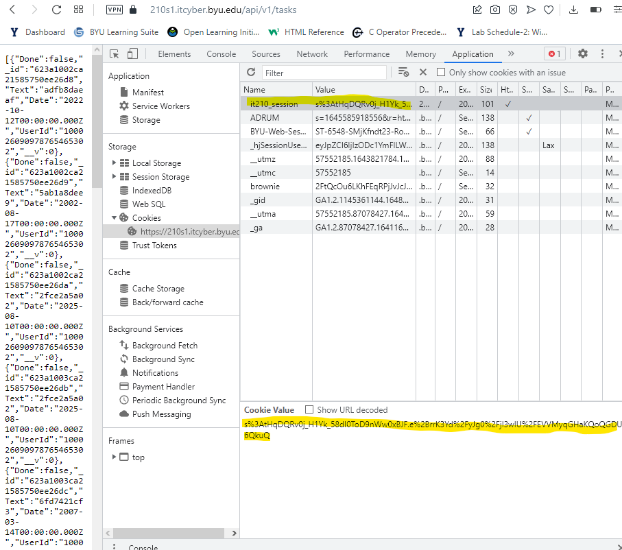
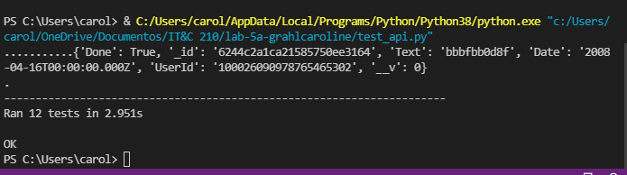
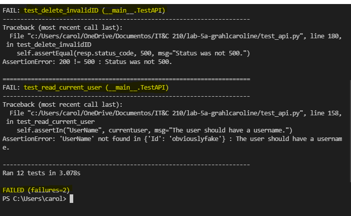
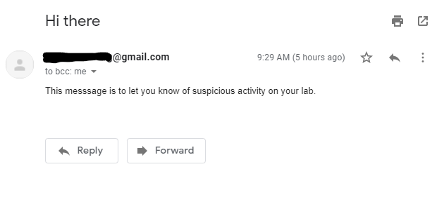

# Lab 5 Writeup

Name: Caroline Grahl
Date: 03/30/2022
Lab 5a — Python and Unit Testing + Lab 5b - Server Hardening and Regex

### Executive Summary
The objective of this lab was to learn more about **Unit Testing**, **Python**, **Server Hardening**, and **Regex**. Being able to protect code and servers is important for a developer's future career. Using **Fail2Ban** to administer the protection of the server and **Python** to perform unit tests can come in handy to save time and money. 

### Design Overview 

**Cookie in Server 1**

**Server 1 Test Result**

**Server 4 Test Result**

**Email from Python Script**

### Writeup Questions

1. Name and discuss at least two of the benefits of writing unit tests before writing code.

Unit testing is very important when writing code because it helps the developer to find bugs in the code at an early stage, which prevents things from breaking later on. Unit testing also helps to reduce costs because finding bugs later when things are more advanced can result in many hours of debugging and trying to find what is wrong. 

2. What would be some of the benefits of automating your test scripts (i.e. so they run at each commit)?

There are many benefits to automating test scripts:
- Saves time
- Makes debugging easier (from the beginning)
- Saves a lot of time
- Improves accuracy
- Runs tests anywhere at any time

3. How long did this lab take for you?

Lab 5a was not very long, so it took me about 5 hours to get everything up and running. There was a lot of copying, pasting, and editing to make sure that things worked. The test for "read all tasks" was the function that kept giving me the wrong result, but I was able to get it fixed. 

### Lessons Learned

#### How To Get a Cookie

Because it is important to have a cookie for testing purposes, learning how to obtain one is very helpful.
1. Go to each of the following websites (test one at a time):
- [S1] https://210s1.itcyber.byu.edu/API/v1/auth/google
- [S2] https://210s2.itcyber.byu.edu/API/v1/auth/google
- [S3] https://210s3.itcyber.byu.edu/API/v1/auth/google
- [S4] https://210s4.itcyber.byu.edu/API/v1/auth/google

2. Sign in with Google Account
3. Right-click on the screen and click on "Inspect"
4. Go to "Application"
5. Click on "it210_session"
6. Paste into code inside test_api.py file

#### Adding Shebang

Defining the location is very important, therefore, adding a shebang line onto the script helps the Unix system to understand that what is being run is a Python script. The following line helps accomplishing this definition:
"#!/usr/bin/env python3" (without quotation marks)
This line should be added at the very top of a .py file and it must be the first thing in the file.

#### How To Test a New Functionality

Being able to test a new functionality should be simple. When changing test functions on test_api.py the developer needs to be sure to call API correctly by adding "from api import API" at the top of the file. Furthermore, the developer should also be sure to pull endpoints to test from api.py. However, if an endpoint needs to be added or edited, it needs to be done by editing api.py, and if the endpoint needs to be edited to be tested in multiple ways, it needs to be done in test_api.py. 

### Conclusions 

- Unit testing before coding
- Documenting methods as code is being written
- Preparing server to prevent attacks

### References 
1. [How to install requests in Python ](https://www.geeksforgeeks.org/how-to-install-requests-in-python-for-windows-linux-mac/)
2. [Introduction to Unit Testing in Python ](https://www.educba.com/unit-testing-in-python/)
3. [Sending Emails With Python ](https://realpython.com/python-send-email/)
4. [REST-API] (https://www.youtube.com/watch?v=qbLc5a9jdXo&t=2s)

### Feedback

Lab 5a was not as clear as I would have liked it to be and 5b also had some issues, especially in the Python Script Triggering part (I thought it was the hardest part for me). However, the TA's were really patient, especially when AWS decided to die on most of us. 
